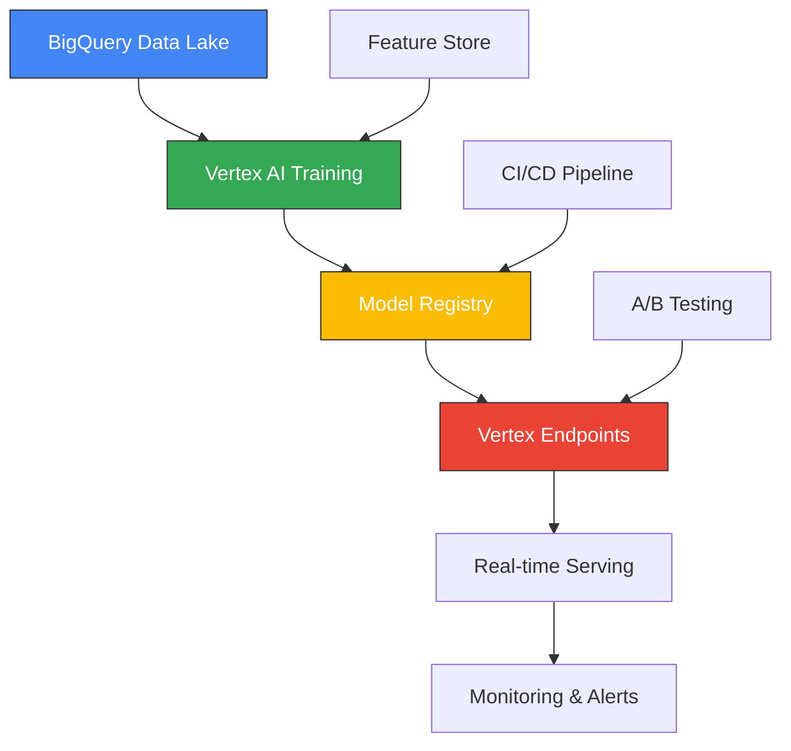

<div align="center">
  
  <!-- Animated Header -->
  
  
  <!-- Primary Action Badges -->
  <p>
    <a href="https://lab.logu.au">
      
    </a>
    <a href="https://logu.au">
      
    </a>
  </p>
  
  <!-- Tech Stack Badges -->
  <p>
    
    
    
    
    
    
    
  </p>
  
</div>

---

## 💭 **PHILOSOPHY & INSPIRATION**

<div align="center">
  
  <!-- Philosophy Section with Visual Elements -->
  <table>
    <tr>
      <td width="180" align="center">
        
      </td>
      <td align="center" style="padding: 0 30px;">
        <h2>🏛️ Ancient Wisdom ⚡ Modern Innovation 🚀</h2>
        <blockquote>
          <h3>கருவியும் காலமும் செய்கையும் செய்யும் <br>
          அருவினையும் மாண்டது அமைச்சு.</h3>
          <p><i>"Excellence emerges when one masters the tools, timing,<br>
          methodology, and the wisdom to tackle the impossible."</i></p>
          <p><strong>— Thirukkural 631 | Chapter: Ministers (அமைச்சு)</strong></p>
        </blockquote>
      </td>
      <td width="180" align="center">
        
      </td>
    </tr>
  </table>
  
</div>

> 💡 **This 2000-year-old wisdom drives my approach to solving 21st-century AI challenges—combining cutting-edge tools, perfect timing, methodical execution, and the audacity to make the impossible possible.**

---

## 🎯 **WHAT I DO**

<div align="center">

### 🚀 **The AI-Powered Banking Revolution**

<table>
<tr>
<td align="center" width="200">
  <br/>
  <strong>Banking regulations<br/>are complex</strong>
</td>
<td align="center" width="80">
  
</td>
<td align="center" width="200">
  <br/>
  <strong>AI needs to be<br/>compliant</strong>
</td>
<td align="center" width="80">
  
</td>
<td align="center" width="200">
  <br/>
  <strong>I make both<br/>work together</strong>
</td>
</tr>
</table>

<br/>

**Stack:** `Vertex AI` + `GenAI` + `FinTech` + `Enterprise Architecture`  
**Status:** `Shipping intelligent compliance solutions at enterprise scale`  

**Mission:** *Transforming complex financial data challenges into intelligent, scalable AI solutions using Google Cloud's enterprise ML platform* 🎯

### 🏭 **Enterprise AI Production Experience**

<table>
<tr>
<td align="center" width="25%">
  <br/>
  <strong>Production ML<br/>Pipelines</strong>
</td>
<td align="center" width="25%">
  <br/>
  <strong>Automated Model<br/>Lifecycle</strong>
</td>
<td align="center" width="25%">
  <br/>
  <strong>Scalable Feature<br/>Engineering</strong>
</td>
<td align="center" width="25%">
  <br/>
  <strong>Enterprise<br/>Governance</strong>
</td>
</tr>
</table>

<br/>

<table>
<tr>
<td width="30%" align="left" valign="top">

### 🎯 **Core Expertise**
- 🏦 **Banking & Finance**
- 🧠 **Vertex AI & ML Engineering**  
- ☁️ **GCP Enterprise Architecture**
- 🔐 **AI Governance & Compliance**
- 📊 **BigQuery ML & Data Engineering**
- ⚡ **Real-time ML Inference**
- 🛡️ **AML & Fraud Detection**
- 🤖 **Production MLOps Pipelines**

### 📈 **Impact Metrics**
  
  
  


</td>
<td width="40%" align="center" valign="middle">


<br/>

**🔄 My Engineering Process:**  
`Identify Challenge` → `Design Solution` → `Build & Deploy` → `Scale Impact`

</td>
<td width="30%" align="left" valign="top">

### 🛠️ **Tech Stack Focus**
- 🧠 **Vertex AI & AutoML**
- 🐍 **Python & FastAPI**
- 📊 **BigQuery ML & SQL**
- 🦙 **Ollama & Local LLMs**
- ☁️ **GCP & Oracle Cloud**
- 🐳 **Docker & Kubernetes**
- 🔄 **Kubeflow & ML Pipelines**
- 🌊 **Apache Airflow**

### 🎯 **Current Focus**
  
  
  


</td>
</tr>
</table>

<br/>

</div>

---

## 🏭 **ENTERPRISE AI EXPERIENCE: VERTEX AI & GCP**

<div align="center">
  
  ### 🎯 *Production-Scale Machine Learning Engineering*
  **Building & deploying enterprise AI solutions that handle billions of transactions**
  
  
  
  
  
</div>

### 🏗️ **VERTEX AI PRODUCTION IMPLEMENTATIONS**

<div align="center">

| 🎯 **Use Case** | 🛠️ **Vertex AI Service** | 📊 **Scale & Impact** | 🔧 **Technical Implementation** |
|:---------------|:----------------------|:-------------------|:----------------------------|
| **🕵️ AML Transaction Monitoring** | AutoML Tables + Custom Training | 50M+ daily transactions | BigQuery ML → Vertex AI pipelines with real-time scoring |
| **🎯 Customer Risk Scoring** | Vertex AI Predictions + Explanations | 2M+ customer profiles | Feature engineering in BigQuery, deployed via Vertex Endpoints |
| **📄 Document Intelligence** | Document AI + Custom Models | 100K+ docs/month processed | Multi-modal AI with OCR + NLP for compliance documentation |
| **🤖 Conversational Banking** | Dialogflow CX + Vertex AI Search | 24/7 customer support | RAG implementation with enterprise knowledge bases |

</div>

### ⚙️ **ENTERPRISE MLOPS ARCHITECTURE**

<div align="center">

<table>
<tr>
<td width="50%" align="left" valign="top">

#### 🔄 **ML Pipeline Orchestration**
- **Vertex AI Pipelines** for end-to-end ML workflows
- **Kubeflow** integration for complex model training
- **Apache Airflow** for data orchestration & scheduling
- **Cloud Build** for CI/CD automation of ML models

#### 📊 **Data Engineering at Scale**
- **BigQuery ML** for feature engineering & model training
- **Dataflow** for real-time stream processing (Apache Beam)
- **Cloud Composer** for workflow orchestration
- **Pub/Sub** for event-driven ML inference triggers

#### 🛡️ **AI Governance & Security**
- **Vertex AI Model Registry** for version control & lineage
- **Cloud IAM** for fine-grained ML resource access
- **Vertex AI Explanations** for model interpretability
- **Data Loss Prevention API** for sensitive data handling

</td>
<td width="50%" align="center" valign="middle">

#### 🏭 **Production Deployment Stack**



**Key Metrics:**
- 🚀 **99.9%** model serving uptime
- ⚡ **<100ms** inference latency
- 📈 **Auto-scaling** 0-1000+ QPS
- 🔍 **Real-time** model monitoring

</td>
</tr>
</table>

</div>

# 🏗️ **MY AI LABORATORY: SELF-HOSTED INFRASTRUCTURE**

<div align="center">
  
  ### 🔬 *Personal Oracle Cloud Infrastructure Laboratory*
  **Production-grade AI/ML experimentation platform for continuous innovation**
  
  
  
  
  
</div>

### 🏛️ **SYSTEM ARCHITECTURE**

<div align="center">
  
</div>

---

## 🌐 **COMPLETE SERVICE ECOSYSTEM**

### 🤖 **AI & MACHINE LEARNING CORE**

<div align="center">

| 🔧 **Service** | 🌐 **Domain** | 🎯 **Purpose** | 📊 **Status** |
|:--------------|:-------------|:-------------|:-------------|
| **🦙 Ollama** | `ollama.logu.au` | Local LLM Hosting & Inference |  |
| **⚡ Apache Spark** | `spark.logu.au` | Distributed ML Processing |  |
| **🌊 Apache Airflow** | `airflow.logu.au` | ML Pipeline Orchestration |  |
| **📈 Langfuse** | `langfuse.logu.au` | LLM Observability & Tracing |  |

</div>

### 📊 **DATA ENGINEERING PLATFORM**

<div align="center">

| 🔧 **Service** | 🌐 **Domain** | 🎯 **Purpose** | 📊 **Status** |
|:--------------|:-------------|:-------------|:-------------|
| **🔄 Airbyte** | `airbyte.logu.au` | Data Integration & ETL |  |
| **🚀 Apache Kafka** | `kafka.logu.au` | Real-time Data Streaming |  |
| **💾 MinIO** | `minio.logu.au` | Object Storage & Data Lake |  |
| **🔍 Trino** | `trino.logu.au` | Distributed Query Engine |  |
| **📊 Metabase** | `metabase.logu.au` | Business Intelligence & Analytics |  |

</div>

### 🛠️ **INFRASTRUCTURE & OPERATIONS**

<div align="center">

| 🔧 **Service** | 🌐 **Domain** | 🎯 **Purpose** | 📊 **Status** |
|:--------------|:-------------|:-------------|:-------------|
| **🔒 Nginx Proxy Manager** | `nginx.logu.au` | Reverse Proxy & SSL |  |
| **🏦 HashiCorp Vault** | `vault.logu.au` | Secrets Management |  |
| **🐳 Portainer** | `portainer.logu.au` | Container Orchestration |  |
| **📈 Grafana** | `grafana.logu.au` | Metrics Visualization |  |
| **⚡ Prometheus** | `prometheus.logu.au` | Metrics Collection |  |
| **💚 Uptime Kuma** | `uptimekuma.logu.au` | Service Health Monitoring |  |
| **📍 Traccar** | `traccar.logu.au` | GPS Tracking & Fleet Management |  |

</div>

### 🎨 **AUTOMATION & MEDIA**

<div align="center">

| 🔧 **Service** | 🌐 **Domain** | 🎯 **Purpose** | 📊 **Status** |
|:--------------|:-------------|:-------------|:-------------|
| **🔗 n8n** | `n8n.logu.au` | Workflow Automation |  |
| **🎵 Jellyfin** | `music.logu.au` | Media Server & Streaming |  |

</div>

---

## 🏆 **FEATURED PROJECTS: KinAI ECOSYSTEM**

<div align="center">

### 🤖 *Privacy-First AI Applications Suite*
**Demonstrating end-to-end ML engineering expertise with real-world impact**


</div>

### 🏠 **SMART HOME & AUTOMATION**

#### 🔍 **[KinAI-Vision](https://github.com/Logulokesh/KinAI-Vision)** - *Real-time Activity Detection*
```
🎯 Culturally-aware home automation with YOLOv8 & InsightFace
🏗️ Scalable microservices architecture for privacy-first experiences  
🌍 Cultural context awareness for personalized automation
```

#### 📍 **[KinAI-GeoPulse](https://github.com/Logulokesh/KinAI-GeoPulse)** - *Privacy-First Family Tracking*
```
🔒 Local processing via Traccar Server & FastAPI
📊 Daily movement summaries with intelligent distance calculations
🌐 Real-time geofencing with privacy controls
```

### 🏥 **HEALTHCARE & FINANCIAL MANAGEMENT**

#### 💊 **[KinAI-CareVault](https://github.com/Logulokesh/KinAI-CareVault)** - *Secure Health Platform*
```
🧠 Powered by Gemma 3/MedGemma 3 for medical intelligence
📄 Intelligent document processing & family health tracking
🔐 Local workflows ensuring compliance & data sovereignty
```

### 🔐 **SECURITY & SURVEILLANCE**

#### 👁️ **[KinAI-NexPatrol](https://github.com/Logulokesh/KinAI-NexPatrol)** - *AI-Powered Surveillance*
```
🎯 AML-inspired risk scoring with YOLOv8 & InsightFace
🔒 Local processing for enhanced security & privacy
⚡ Precise threat detection algorithms for secure environments
```

### 🎓 **EDUCATION & LEARNING**

#### 📚 **[KinAI-ScholarKit](https://github.com/Logulokesh/KinAI-ScholarKit)** - *Offline Educational AI*
```
🧠 RAG pipeline with FAISS & NetworkX for personalized learning
🔒 Privacy-focused design with comprehensive PDF exports
📖 Curriculum-aligned educational content generation
```

#### 🗣️ **[KinAI-Mentor](https://github.com/Logulokesh/kinai-mentor)** - *Voice-Driven AI Tutor*
```
🎙️ Multi-modal interaction with Victorian Curriculum alignment
🔒 Complete privacy with local processing
♿ Inclusive design for diverse learning needs
```

---

## 📜 **Professional Certifications**

<div align="center">

### 🎓 **Google Cloud Platform Excellence**


### 🔶 **Oracle Cloud Infrastructure**


</div>

---

## 🧠 **CURRENT LEARNING FOCUS**

<div align="center">

<table>
<tr>
<td align="center" width="33%">

### 🔬 **Advanced Vertex AI & GenAI**

```
🎯 Multi-modal AI applications with Gemini Pro
🏗️ Custom training with Vertex AI Workbench
📊 Advanced model monitoring and drift detection
🔧 Vertex AI Pipelines for enterprise MLOps
```

</td>
<td align="center" width="33%">

### 🏢 **Enterprise AI Architecture**

```
⚖️ Responsible AI framework implementation
🛡️ Privacy-preserving ML techniques
🔄 Federated learning for multi-party scenarios
📋 Model governance and audit trails
```

</td>
<td align="center" width="33%">

### 🔄 **Next-Gen MLOps**

```
🚀 Real-time model serving at scale
🔍 Advanced feature engineering and stores
⚡ Edge AI deployment strategies
🧪 Continuous ML experimentation platforms
```

</td>
</tr>
</table>

</div>

---

<div align="center">
  
**🌟 Building the future of AI-powered financial technology, one innovation at a time 🌟**


[](mailto:hello@logu.au)
[](https://linkedin.com/in/logulokesh)
[](https://github.com/logulokesh)

</div>

---

## 🛠️ **TECHNICAL ARSENAL**

### ☁️ **Cloud & Infrastructure**
<div align="left">


</div>

### 💻 **Programming & Development**
<div align="left">


</div>

### 📊 **Data & Analytics**
<div align="left">


</div>

### 🤖 **AI/ML & GenAI**
<div align="left">


</div>

### 📈 **Monitoring & Visualization**
<div align="left">


</div>

---

## 🎯 **EXPERTISE & INNOVATION**

<div align="left">

| 🔍 **FINANCIAL CRIME TECHNOLOGY** | 🏗️ **MODERN DATA ARCHITECTURE** | 🤖 **AI/ML IN BANKING** |
|:---:|:---:|:---:|
|  |  |  |
| 💰 **Anti-Money Laundering (AML)** system optimization | 🌐 **Data mesh** implementation strategies | 🧠 **GenAI applications** for financial services |
| 🕵️ **Fraud detection** algorithm development | 🏠 **Lakehouse architecture** design | ⚖️ **ML model governance** & risk management |
| 📋 **Regulatory compliance** automation | ⚡ **Real-time analytics** platforms | 🛡️ **Responsible AI** implementation frameworks |

</div>

---

## 🐍 **Contribution Activity**

<div align="center">
  
  **🔄 Commit 📝 → Push ⏫ → Repeat 🔁**
  
  <picture>
    <source media="(prefers-color-scheme: dark)" srcset="https://github.com/Logulokesh/Logulokesh/blob/output/github-contribution-grid-snake-dark.svg">
    <source media="(prefers-color-scheme: light)" srcset="https://github.com/Logulokesh/Logulokesh/blob/output/github-contribution-grid-snake.svg">
    
  </picture>
  
</div>

---

## 🤝 **Let's Connect & Collaborate**

<div align="center">

### 🌟 **Ready to discuss AI, cloud architecture, or innovative projects?**

[](mailto:hello@logu.au)
[](https://linkedin.com/in/logulokesh)
[](https://github.com/logulokesh)

---

### 💭 **Philosophy**

> *"Excellence emerges when one masters the tools, timing, methodology, and the wisdom to tackle the impossible."*

**🚀 Building tomorrow's financial technology with AI-powered innovation 🚀**

</div>

---
