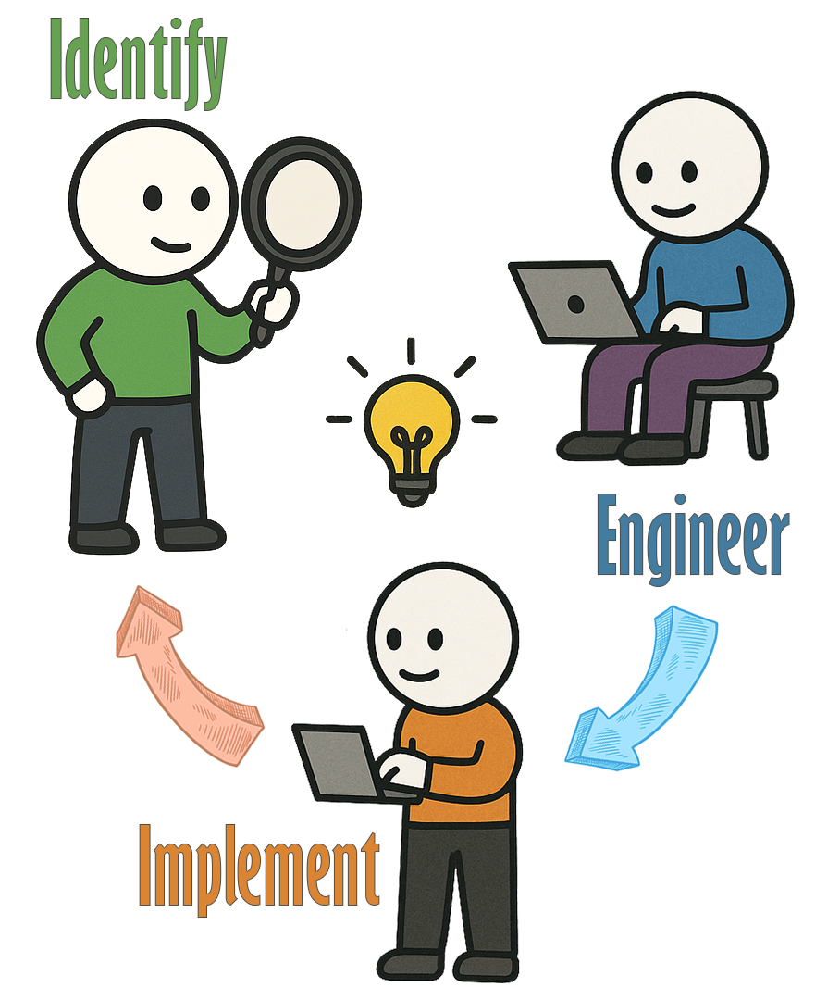
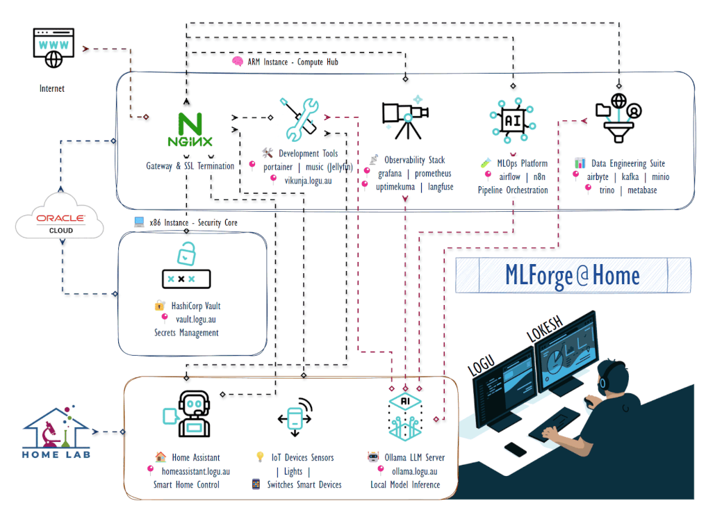

<!-- Profile Header -->

  

  

## 💭 **Philosophy & Inspiration**

  <table>
    <tr>
      <td width="150" align="center">
        
      </td>
      <td align="center" style="padding: 0 20px;">
        <h3>கருவியும் காலமும் செய்கையும் செய்யும் 
        அருவினையும் மாண்டது அமைச்சு.</h3>
        
<i>"Excellence emerges when one masters the tools, timing, 
        methodology, and the wisdom to tackle the impossible."</i>

        
<strong>— Thirukkural 632, Chapter: Ministers (அமைச்சு)</strong>

      </td>
      <td width="150" align="center">
        
      </td>
    </tr>
  </table>

> This ancient wisdom guides my approach to modern technology challenges—combining the right tools, perfect timing, methodical execution, and the courage to solve seemingly impossible problems.

---

## 🎯 **My Problem-Solving Philosophy: From Enterprise Scale to Personal Solutions**

### **Identify Challenge → Engineer Approach → Implement Outcome** 🚀

**Machine Learning & GenAI Engineer** specializing in **BANKING**  
*Bridging complex data challenges with practical AI solutions, transforming regulatory requirements into intelligent, scalable systems.*

---

  

---

# 🏠 **Self-Hosted AI & Data Engineering Playground**

*Personal Oracle Cloud Infrastructure laboratory for AI/ML experimentation, modern data engineering, and cloud-native technology development - designed for continuous learning and hands-on exploration with production-grade systems.*

## 🏗️ **System Architecture**

  

## 🧩 **Complete Service Ecosystem**

### 🤖 **AI & Machine Learning Core**
| Service | Domain | Purpose | Status |
|---------|---------|----------|--------|
| **Ollama** | `ollama.logu.au` | Local LLM hosting & inference | 🟢 |
| **Apache Spark** | `spark.logu.au` | Distributed ML processing | 🟢 |
| **Apache Airflow** | `airflow.logu.au` | ML pipeline orchestration | 🟢 |
| **Langfuse** | `langfuse.logu.au` | LLM observability & tracing | 🟢 |

### 📊 **Data Engineering Platform**
| Service | Domain | Purpose | Status |
|---------|---------|----------|--------|
| **Airbyte** | `airbyte.logu.au` | Data integration & ETL | 🟢 |
| **Apache Kafka** | `kafka.logu.au` | Real-time data streaming | 🟢 |
| **MinIO** | `minio.logu.au` | Object storage & data lake | 🟢 |
| **Trino** | `trino.logu.au` | Distributed query engine | 🟢 |
| **Metabase** | `metabase.logu.au` | Business intelligence & analytics | 🟢 |

### 🔧 **Infrastructure & Operations**
| Service | Domain | Purpose | Status |
|---------|---------|----------|--------|
| **Nginx Proxy Manager** | `nginx.logu.au` | Reverse proxy & SSL management | 🟢 |
| **HashiCorp Vault** | `vault.logu.au` | Secrets & credential management | 🟢 |
| **Portainer** | `portainer.logu.au` | Container orchestration UI | 🟢 |
| **Grafana** | `grafana.logu.au` | Metrics visualization & dashboards | 🟢 |
| **Prometheus** | `prometheus.logu.au` | Metrics collection & alerting | 🟢 |
| **Uptime Kuma** | `uptimekuma.logu.au` | Service health monitoring | 🟢 |
| **Traccar** | `traccar.logu.au` | GPS tracking & fleet management | 🟢 |

### 🎨 **Automation & Media**
| Service | Domain | Purpose | Status |
|---------|---------|----------|--------|
| **n8n** | `n8n.logu.au` | Workflow automation & integration | 🟢 |
| **Jellyfin** | `music.logu.au` | Media server & streaming | 🟢 |

---

## 🌟 **Key Architectural Decisions**

- **ARM-Optimized ML Stack**: Leveraging ARM architecture for cost-effective ML workloads
- **Cloud-Native Design**: Containerized services with automated scaling and recovery
- **Security-First Approach**: Centralized secrets management with HashiCorp Vault
- **Observability by Design**: Comprehensive monitoring from infrastructure to ML models
- **Production-Ready MLOps**: Complete CI/CD pipelines for ML model deployment

---

## 🚀 **Featured Projects: KinAI Ecosystem**

*A comprehensive suite of privacy-first AI applications demonstrating end-to-end ML engineering expertise*

### 🏠 **Smart Home & Automation**
**[KinAI-Vision](https://github.com/Logulokesh/KinAI-Vision)** - Real-time activity detection for culturally aware home automation
- Local processing with YOLOv8, InsightFace, and LangChain
- Scalable microservices architecture for privacy-first experiences
- Cultural context awareness for personalized automation

**[KinAI-GeoPulse](https://github.com/Logulokesh/KinAI-GeoPulse)** - Privacy-first family tracking with real-time geofencing
- Local processing via Traccar Server and FastAPI integration
- Daily movement summaries and intelligent distance calculations
- Real-time location monitoring with privacy controls

### 🏥 **Healthcare & Financial Management**
**[KinAI-CareVault](https://github.com/Logulokesh/KinAI-CareVault)** - Secure health and financial management platform
- Powered by Gemma 3/MedGemma 3 for medical intelligence
- Intelligent document processing and family health tracking
- Local workflows ensuring compliance and data sovereignty

### 🔐 **Security & Surveillance**
**[KinAI-NexPatrol](https://github.com/Logulokesh/KinAI-NexPatrol)** - AI-powered surveillance with AML-inspired risk scoring
- Advanced face recognition using YOLOv8 and InsightFace
- Local processing for enhanced security and privacy
- Precise threat detection algorithms for secure environments

### 🎓 **Education & Learning**
**[KinAI-ScholarKit](https://github.com/Logulokesh/KinAI-ScholarKit)** - Offline, curriculum-aligned educational activity generator
- RAG pipeline with FAISS and NetworkX for personalized learning paths
- Privacy-focused design with comprehensive PDF export capabilities
- Intelligent content generation aligned with educational standards

**[KinAI-Mentor](https://github.com/Logulokesh/kinai-mentor)** - Voice-driven, offline AI tutor for accessible education
- Multi-modal interaction capabilities aligned with Victorian Curriculum
- Local processing ensuring complete privacy and data control
- Inclusive design for diverse learning needs and accessibility

---

## 📜 **Professional Certifications**

**Google Cloud Platform Excellence**
- 🥇 Professional Cloud Architect
- 🥇 Professional Machine Learning Engineer  
- 🥇 Professional Data Engineer
- 🥇 Professional Cloud Security Engineer
- 🥇 Professional Cloud Database Engineer
- 🥇 Cloud Digital Leader

**Oracle Cloud Infrastructure**
- 🥇 Oracle Certified Associate

---

## 🧠 **Current Learning Focus**

**🔬 GenAI & Financial Crime Detection**
- Developing intelligent investigation assistants using large language models
- Implementing retrieval-augmented generation (RAG) for compliance documentation
- Advanced prompt engineering techniques for financial analysis

**🔄 MLOps & Model Governance**
- Self-hosted LLM deployment strategies using Ollama and Llama.cpp
- ML model observability and concept drift detection in production
- Data mesh architecture implementation with robust metadata management

**⚡ Advanced AI Infrastructure**
- Vector database optimization for similarity search in financial transactions
- Real-time model serving with low-latency inference requirements
- Automated model retraining pipelines with continuous validation

---

## 🛠️ **Technical Expertise**

### **Cloud & Infrastructure**
`AWS` • `GCP` • `Oracle Cloud Infrastructure` • `Docker` • `Kubernetes` • `HashiCorp Vault`

### **Programming & Development**
`Python` • `Java` • `SQL` • `Apache Spark` • `Apache Kafka` • `Apache Hadoop`

### **Data & Analytics**
`BigQuery` • `Redshift` • `Snowflake` • `PostgreSQL` • `DBT` • `Apache Airflow` • `Airbyte` • `Trino`

### **AI/ML & GenAI**
`LangChain` • `LlamaIndex` • `LangGraph` • `CrewAI` • `Ollama` • `Hugging Face` • `OpenAI API`

### **ML Platforms & Tools**
`MLflow` • `Weights & Biases` • `TensorFlow` • `PyTorch` • `Chroma` • `Pinecone` • `Weaviate`

### **Monitoring & Visualization**
`Grafana` • `Prometheus` • `Metabase` • `Langfuse` • `MinIO` • `Nginx`

### **Automation & Orchestration**
`n8n` • `Zapier` • `AutoGen` • `AutoGPT` • `Google Cloud Composer`

---

## 🤝 **Let's Connect & Collaborate**

**🔍 Financial Crime Technology**
- Anti-Money Laundering (AML) system optimization
- Fraud detection algorithm development
- Regulatory compliance automation

**🏗️ Modern Data Architecture**
- Data mesh implementation strategies
- Lakehouse architecture design
- Real-time analytics platforms

**🤖 AI/ML in Banking**
- GenAI applications for financial services
- ML model governance and risk management
- Responsible AI implementation frameworks

**📧 Contact:** [dlogulokesh@gmail.com](mailto:dlogulokesh@gmail.com)

---

<!-- GitHub Activity Snake -->

  <picture>
    <source media="(prefers-color-scheme: dark)" srcset="https://github.com/Logulokesh/Logulokesh/blob/output/github-contribution-grid-snake-dark.svg">
    <source media="(prefers-color-scheme: light)" srcset="https://github.com/Logulokesh/Logulokesh/blob/output/github-contribution-grid-snake.svg">
    
  </picture>

