# ML & GenAI Enthusiast 
<!-- Profile Images -->

  

  

<!-- GitHub Activity Snake -->

  <picture>
    <source media="(prefers-color-scheme: dark)" srcset="https://github.com/Logulokesh/Logulokesh/blob/output/github-contribution-grid-snake-dark.svg">
    <source media="(prefers-color-scheme: light)" srcset="https://github.com/Logulokesh/Logulokesh/blob/output/github-contribution-grid-snake.svg">
    
  </picture>

## **1. Identify the Challenge → 2. Engineer the Approach → 3. Implement the Outcome** 🚀

**Machine Learning & GenAI Engineer** specializing in financial crime detection. I bridge the gap between complex data challenges and practical AI solutions, transforming regulatory requirements into intelligent, scalable systems.

  

---

# 🏠 **Self-Hosted AI & Data Engineering Playground**

*My personal self-hosted playground for AI/ML experimentation, modern data engineering, and cloud-native technology development on Oracle Cloud Infrastructure - designed for continuous learning and hands-on exploration.*

## 🎯 **Mission Statement**
This is my dedicated learning environment where I build and experiment with production-grade AI systems. It serves as my personal laboratory for exploring end-to-end machine learning workflows, from data ingestion to model deployment, with particular focus on financial crime detection use cases and GenAI applications. Every service and integration here represents a learning journey and practical experimentation with cutting-edge technologies.

## 🏗️ **System Architecture**

```mermaid
---
config:
  layout: elk
---
flowchart LR
    subgraph ARM["🧠 ARM Instance - AI Powerhouse"]
        AI["🤖 Ollama LLM Server<br/>📍 ollama.logu.au<br/>Local Model Inference"]
        NPM["🌐 Nginx Proxy Manager<br/>📍 nginx.logu.au<br/>Gateway & SSL Termination"]
        Data["📊 Data Engineering Suite<br/>📍 airbyte | kafka | minio<br/>📍 trino | metabase"]
        ML["🧪 MLOps Platform<br/>📍 airflow | n8n<br/>Pipeline Orchestration"]
        Monitor["📡 Observability Stack<br/>📍 grafana | prometheus<br/>📍 uptimekuma | langfuse"]
        Tools["🛠️ Development Tools<br/>📍 portainer<br/>📍 music (Jellyfin)"]
    end
    
    subgraph X86["💻 x86 Instance - Security Core"]
        Vault["🔐 HashiCorp Vault<br/>📍 vault.logu.au<br/>Secrets Management"]
    end
    
    OCI["☁️ Oracle Cloud Infrastructure"] --> NPM
    NPM --> AI & Data & ML & Monitor & Tools
    NPM --> Vault
    AI <--> Data
    ML <--> AI & Data
    Monitor --> AI & Data & ML
    Vault -.-> ARM
```

## 🧩 **Service Ecosystem**

### **🤖 AI & Machine Learning Core**
| Service | Domain | Purpose | Architecture |
|---------|---------|----------|--------------|
| **Ollama** | ollama.logu.au | Local LLM hosting & inference | ARM |
| **Apache Spark** | spark.logu.au | Distributed ML processing | ARM |
| **Apache Airflow** | airflow.logu.au | ML pipeline orchestration | ARM |
| **Langfuse** | langfuse.logu.au | LLM observability & tracing | ARM |

### **📊 Data Engineering Platform**
| Service | Domain | Purpose | Architecture |
|---------|---------|----------|--------------|
| **Airbyte** | airbyte.logu.au | Data integration & ETL | ARM |
| **Apache Kafka** | kafka.logu.au | Real-time data streaming | ARM |
| **MinIO** | minio.logu.au | Object storage & data lake | ARM |
| **Trino** | trino.logu.au | Distributed query engine | ARM |
| **Metabase** | metabase.logu.au | Business intelligence & analytics | ARM |

### **🔧 Infrastructure & Operations**
| Service | Domain | Purpose | Architecture |
|---------|---------|----------|--------------|
| **Nginx Proxy Manager** | nginx.logu.au | Reverse proxy & SSL management | ARM |
| **HashiCorp Vault** | vault.logu.au | Secrets & credential management | x86 |
| **Portainer** | portainer.logu.au | Container orchestration UI | ARM |
| **Grafana** | grafana.logu.au | Metrics visualization & dashboards | ARM |
| **Prometheus** | prometheus.logu.au | Metrics collection & alerting | ARM |
| **Uptime Kuma** | uptimekuma.logu.au | Service health monitoring | ARM |

### **🎨 Automation & Media**
| Service | Domain | Purpose | Architecture |
|---------|---------|----------|--------------|
| **n8n** | n8n.logu.au | Workflow automation & integration | ARM |
| **Jellyfin** | music.logu.au | Media server & streaming | ARM |

## 🌟 **Key Architectural Decisions**

- **ARM-Optimized ML Stack**: Leveraging ARM architecture for cost-effective ML workloads
- **Cloud-Native Design**: Containerized services with automated scaling and recovery
- **Security-First Approach**: Centralized secrets management with HashiCorp Vault
- **Observability by Design**: Comprehensive monitoring from infrastructure to ML models
- **Production-Ready MLOps**: Complete CI/CD pipelines for ML model deployment

---

## 🏅 **Professional Certifications**

**Google Cloud Platform Excellence**
- Professional Cloud Architect
- Professional Machine Learning Engineer  
- Professional Data Engineer
- Professional Cloud Security Engineer
- Professional Cloud Database Engineer
- Cloud Digital Leader

**Oracle Cloud Infrastructure**
- Oracle Certified Associate

---

## 🧠 **Current Learning Focus**

**GenAI & Financial Crime Detection**
- Developing intelligent investigation assistants using large language models
- Implementing retrieval-augmented generation (RAG) for compliance documentation
- Advanced prompt engineering techniques for financial analysis

**MLOps & Model Governance**
- Self-hosted LLM deployment strategies using Ollama and Llama.cpp
- ML model observability and concept drift detection in production
- Data mesh architecture implementation with robust metadata management

**Advanced AI Infrastructure**
- Vector database optimization for similarity search in financial transactions
- Real-time model serving with low-latency inference requirements
- Automated model retraining pipelines with continuous validation

---

## 🛠️ **Technical Expertise**

### **☁️ Cloud & Infrastructure**
AWS • GCP • Oracle Cloud Infrastructure • Docker • Kubernetes • HashiCorp Vault

### **💻 Programming & Development**
Python • Java • SQL • Apache Spark • Apache Kafka • Apache Hadoop

### **🗄️ Data & Analytics**
BigQuery • Redshift • Snowflake • PostgreSQL • DBT • Apache Airflow • Airbyte • Trino

### **🤖 AI/ML & GenAI**
LangChain • LlamaIndex • LangGraph • CrewAI • Ollama • Hugging Face Transformers • OpenAI API

### **📊 ML Platforms & Tools**
MLflow • Weights & Biases • TensorFlow • PyTorch • Chroma • Pinecone • Weaviate

### **📈 Monitoring & Visualization**
Grafana • Prometheus • Metabase • Langfuse • MinIO • Nginx

### **🔄 Automation & Orchestration**
n8n • Zapier • AutoGen • AutoGPT • Google Cloud Composer

---

## 🤝 **Let's Connect & Collaborate**

I'm actively seeking opportunities to collaborate on:

**🔍 Financial Crime Technology**
- Anti-Money Laundering (AML) system optimization
- Fraud detection algorithm development
- Regulatory compliance automation

**🏗️ Modern Data Architecture**
- Data mesh implementation strategies
- Lakehouse architecture design
- Real-time analytics platforms

**🤖 AI/ML in Banking**
- GenAI applications for financial services
- ML model governance and risk management
- Responsible AI implementation frameworks

**📧 Contact:** [dlogulokesh@gmail.com](mailto:dlogulokesh@gmail.com)

---

## 💭 **Philosophy & Inspiration**

  <table style="border: none; border-collapse: collapse;">
    <tr style="border: none;">
      <td width="150" align="center" style="border: none;">
        
      </td>
      <td style="padding: 0 20px; border: none;">
        

          

            <h3 style="margin: 0;">கருவியும் காலமும் செய்கையும் செய்யும் 
            அருவினையும் மாண்டது அமைச்சு.</h3>
            
<i>"Excellence emerges when one masters the tools, timing, 
            methodology, and the wisdom to tackle the impossible."</i>

          

          

            
<strong>— Thirukkural 632 Chapter: Ministers (அமைச்சு)</strong>

          

        

      </td>
      <td width="150" align="center" style="border: none;">
        
      </td>
    </tr>
  </table>

*This ancient wisdom guides my approach to modern technology challenges—combining the right tools, perfect timing, methodical execution, and the courage to solve seemingly impossible problems.*
