<!-- Top Image (50% size of bottom image) -->

  

<!-- Bottom Image (full size) -->

  

  <picture>
    <source media="(prefers-color-scheme: dark)" srcset="https://github.com/Logulokesh/Logulokesh/blob/output/github-contribution-grid-snake-dark.svg ">
    <source media="(prefers-color-scheme: light)" srcset="https://github.com/Logulokesh/Logulokesh/blob/output/github-contribution-grid-snake.svg ">
    
  </picture>

## 1. Identify the Challenge → 2. Engineer the Approach → 3. Implement the Outcome 👋
👨‍💻 ML & GenAI engineer in financial crime. I solve real-world problems by spotting small gaps and building smart, practical solutions.

  

---
# 🤖 AI-Powered Modern Data Stack Home Lab

A comprehensive self-managed playground for experimenting with AI/ML workflows, modern data engineering, and cloud-native technologies hosted on Oracle Cloud Infrastructure (OCI). Designed specifically for AI project development and machine learning experimentation.

## 🏗️ Architecture Overview

This home lab demonstrates a complete AI-ready data stack with containerized services orchestrated across Oracle Cloud Infrastructure, showcasing real-world machine learning pipelines, data engineering patterns, and AI model deployment strategies.

```mermaid
---
config:
  layout: elk
---
flowchart LR
 subgraph ARM["🧠 ARM Instance - AI Stack"]
        AI["🤖 Ollama LLM<br>ollama.logu.au<br>Local LLM Inference"]
        NPM["🔀 Nginx Proxy Manager<br>nginx.logu.au<br>AI Gateway &amp; SSL"]
        Data["📊 Data Platform<br>airbyte.logu.au, kafka.logu.au<br>minio.logu.au, trino.logu.au, metabase.logu.au"]
        AutoML["🧪 ML Orchestration<br>airflow.logu.au, n8n.logu.au<br>Pipeline &amp; Automation"]
        Monitor["📡 Monitoring<br>grafana.logu.au, prometheus.logu.au<br>uptimekuma.logu.au, langfuse.logu.au"]
        Tools["🛠️ Dev Tools<br>portainer.logu.au<br>music.logu.au (Jellyfin)"]
  end
 subgraph X86["💻 x86 Instance"]
        Vault["🔐 HashiCorp Vault<br>vault.logu.au<br>Secrets &amp; API Keys"]
  end
    OCI["☁️ Oracle Cloud Infrastructure"] --> NPM
    NPM --> AI & Data & AutoML & Monitor & Tools & Vault
    AI --> Data
    AutoML --> AI & Data
    Monitor --> AI
    Vault --> ARM

```

## 📊 Services Overview

| Service | Subdomain | Category | AI/ML Use Case | Architecture |
|---------|-----------|----------|----------------|--------------|
| **Airbyte** | airbyte.logu.au | Data Integration | ML Data Ingestion & Feature Engineering | ARM |
| **Apache Spark** | spark.logu.au | ML Processing | Distributed ML Training & Data Processing | ARM |
| **Portainer** | portainer.logu.au | Container Management | ML Container Orchestration & Monitoring | ARM |
| **HashiCorp Vault** | vault.logu.au | Security | AI Model Secrets & API Key Management | x86 |
| **Apache Airflow** | airflow.logu.au | ML Orchestration | ML Pipeline Automation & Model Training | ARM |
| **Nginx Proxy Manager** | nginx.logu.au | Infrastructure | AI Service Gateway & SSL Management | ARM |
| **Apache Kafka** | kafka.logu.au | Data Streaming | Real-time ML Feature Streaming | ARM |
| **MinIO** | minio.logu.au | ML Storage | AI Model Storage & Training Data Lake | ARM |
| **Grafana** | grafana.logu.au | ML Monitoring | Model Performance & Training Metrics | ARM |
| **Trino** | trino.logu.au | ML Analytics | Feature Store Queries & ML Data Analysis | ARM |
| **Prometheus** | prometheus.logu.au | ML Metrics | AI Model Monitoring & Performance Tracking | ARM |
| **Metabase** | metabase.logu.au | ML Business Intelligence | ML Experiment Tracking & Model Analytics | ARM |
| **Jellyfin** | music.logu.au | Media | AI-Enhanced Media Processing & Streaming | ARM |
| **n8n** | n8n.logu.au | AI Automation | AI Workflow Automation & Model Integration | ARM |
| **Uptime Kuma** | uptimekuma.logu.au | AI Monitoring | ML Service Health & Model Endpoint Monitoring | ARM |
| **Ollama** | ollama.logu.au | **AI/ML Core** | **Local LLM Hosting & AI Model Inference** | ARM |

## 🏛️ Architecture Highlights

**AI-First Infrastructure**: ARM instance optimized for ML workloads with Ollama LLM server, Spark ML processing, and AI-ready data pipelines.

**Complete MLOps Pipeline**: From data ingestion (Airbyte) → ML processing (Spark) → model storage (MinIO) → inference (Ollama) → monitoring (Grafana/Prometheus).

**Production ML Environment**: Containerized AI services with automated model deployment, comprehensive ML monitoring, and secure API key management via Vault.

---

*This AI-focused home lab represents a production-like environment for learning machine learning engineering, MLOps practices, and AI application development in a self-managed, cost-effective setup on Oracle Cloud Infrastructure.*

---

## 🏆 Certifications

- **GCP Professional Cloud Architect**  
- **GCP Professional Machine Learning Engineer**  
- **GCP Professional Data Engineer**  
- **GCP Professional Cloud Security Engineer**  
- **GCP Professional Cloud Database Engineer**  
- **GCP Cloud Digital Leader**  
- **Oracle Certified Associate**  

---

## 🧠 What I’m Learning Now

- Exploring **GenAI-powered investigation assistants** for financial crime detection.
- Fine-tuning **LLMs**, experimenting with **RAG pipelines**, and prompt engineering.
- Enhancing **observability in ML models** and detecting concept drift in production.
- Building **self-hosted LLMs** using **Ollama, Llama.cpp, and HuggingFace Transformers**.
- Strengthening **data mesh principles** and improving **metadata management**.

---

## 🛠 Skills

- **Cloud Platforms**: AWS, GCP, Oracle Cloud
- **Programming Languages**: Python, Java, SQL
- **Data Warehousing**: BigQuery, Redshift, Snowflake, PostgreSQL
- **Data Pipelines**: Apache Airflow, Google Cloud Composer, Airbyte
- **Big Data Technologies**: Spark, Kafka, Hadoop, Dataflow
- **Data Modeling & Governance**: DBT, Dataplex
- **Containerization**: Docker, Kubernetes
- **Security & Infrastructure**: HashiCorp Vault, Cloud KMS
- **Monitoring & Visualization**: Grafana, Prometheus, Metabase
- **Query Engines**: Trino
- **Web Servers**: Nginx, Apache
- **Object Storage**: MinIO, AWS S3, GCS

---

## 📬 Get in Touch

Feel free to connect or collaborate if you're working in:
- Financial Crime Detection (AML, Fraud)
- Modern Data Architecture (Data Mesh, Lakehouses)
- AI/ML & GenAI in Banking
- Cloud-Native AI/ML Engineering

- 📨 Email: [dlogulokesh@gmail.com](mailto:dlogulokesh@gmail.com)

---

  <table style="border: none; border-collapse: collapse;">
    <tr style="border: none;">
      <td width="150" align="center" style="border: none;">
        
      </td>
      <td style="padding: 0 20px; border: none;">
        

          

            <h3 style="margin: 0;">கருவியும் காலமும் செய்கையும் செய்யும் 
            அருவினையும் மாண்டது அமைச்சு.</h3>
            
<i>A minister excels when he possesses the means, the right time, 
            the method of execution, and the ability to accomplish difficult tasks.</i>

          

          

            
<strong>— Thirukkural 632 Chapter: Ministers (அமைச்சு)</strong>

          

        

      </td>
      <td width="150" align="center" style="border: none;">
        
      </td>
    </tr>
  </table>

