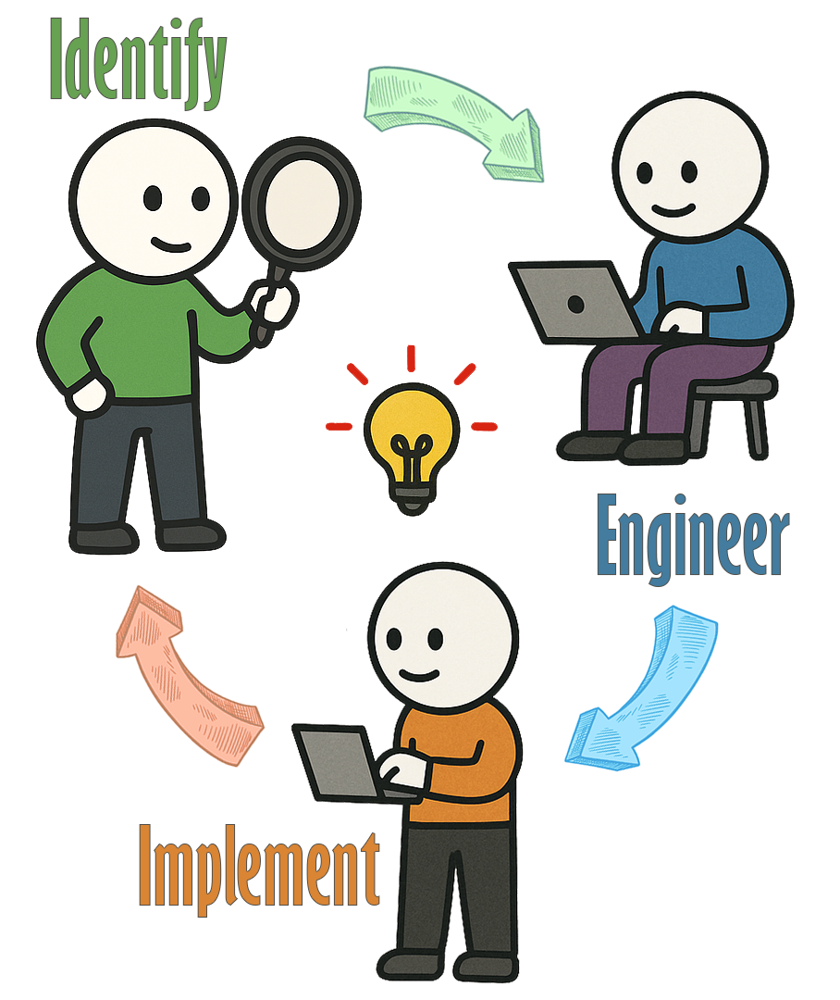

# 💡 I apply AI/ML to real-world 🌍 problems🔧

<div align="center">
  
  <!-- Animated Header -->
  
  
  <br><br>
  
  <!-- Dynamic Logo -->
  
  <!-- Tech Stack Badges -->
  
  
  
  
  
  
    

  
</div>

---

## 💭 **PHILOSOPHY & INSPIRATION**

<div align="center">
  
  <!-- Philosophy Section with Visual Elements -->
  <table>
    <tr>
      <td width="180" align="center">
        
      </td>
      <td align="center" style="padding: 0 30px;">
        <h2>🏛️ **Ancient Wisdom → Modern Innovation**</h2>
        <blockquote>
          <h3>கருவியும் காலமும் செய்கையும் செய்யும்<br>
          அருवினையும் மாண்டது அமைச்சு.</h3>
          <p><i>"Excellence emerges when one masters the tools, timing,<br>
          methodology, and the wisdom to tackle the impossible."</i></p>
          <p><strong>— Thirukkural 631 | Chapter: Ministers (அமைச்சு)</strong></p>
        </blockquote>
      </td>
      <td width="180" align="center">
        
      </td>
    </tr>
  </table>
  
</div>

> 💡 **This 2000-year-old wisdom drives my approach to solving 21st-century AI challenges—combining cutting-edge tools, perfect timing, methodical execution, and the audacity to make the impossible possible.**

---
## 🎯 **WHAT I DO**

<div align="center">
<table>
<tr>
<td align="center">🏦<br/><strong>Banking regulations<br/>are complex</strong></td>
<td align="center">➡️</td>
<td align="center">🤖<br/><strong>AI needs to be<br/>compliant</strong></td>
<td align="center">➡️</td>
<td align="center">⚡<br/><strong>I make both<br/>work together</strong></td>
</tr>
</table>
</div>


<div align="center">

**Stack:** `GenAI` + `FinTech` + `Enterprise Architecture`  
**Status:** `Shipping intelligent compliance solutions`  

**Mission:** *Transforming complex financial data challenges into intelligent, scalable AI solutions* 🎯
  


**🔄 My Process:** `Identify Challenge` → `Engineer Approach` → `Implement Outcome` → `🚀 Scale Impact`


</div>


---

## 🏗️ **MY AI LABORATORY: SELF-HOSTED INFRASTRUCTURE**

<div align="center">
  
   
  ### 🔬 *Personal Oracle Cloud Infrastructure Laboratory*
  **Production-grade AI/ML experimentation platform for continuous innovation**
  
</div>

### 🏛️ **SYSTEM ARCHITECTURE**

<div align="center">
  
</div>

---

## 🌐 **COMPLETE SERVICE ECOSYSTEM**

### 🤖 **AI & MACHINE LEARNING CORE**

| 🔧 **Service** | 🌐 **Domain** | 🎯 **Purpose** | 📊 **Status** |
|:--------------|:-------------|:-------------|:-------------|
| **🦙 Ollama** | `ollama.logu.au` | Local LLM Hosting & Inference | ✅ **LIVE** |
| **⚡ Apache Spark** | `spark.logu.au` | Distributed ML Processing | 🔴 **DOWN** |
| **🌊 Apache Airflow** | `airflow.logu.au` | ML Pipeline Orchestration | ✅ **LIVE** |
| **📈 Langfuse** | `langfuse.logu.au` | LLM Observability & Tracing | ✅ **LIVE** |

### 📊 **DATA ENGINEERING PLATFORM**

| 🔧 **Service** | 🌐 **Domain** | 🎯 **Purpose** | 📊 **Status** |
|:--------------|:-------------|:-------------|:-------------|
| **🔄 Airbyte** | `airbyte.logu.au` | Data Integration & ETL | ✅ **LIVE** |
| **🚀 Apache Kafka** | `kafka.logu.au` | Real-time Data Streaming | ✅ **LIVE** |
| **💾 MinIO** | `minio.logu.au` | Object Storage & Data Lake | ✅ **LIVE** |
| **🔍 Trino** | `trino.logu.au` | Distributed Query Engine | ✅ **LIVE** |
| **📊 Metabase** | `metabase.logu.au` | Business Intelligence & Analytics | ✅ **LIVE** |

### 🛠️ **INFRASTRUCTURE & OPERATIONS**

| 🔧 **Service** | 🌐 **Domain** | 🎯 **Purpose** | 📊 **Status** |
|:--------------|:-------------|:-------------|:-------------|
| **🔒 Nginx Proxy Manager** | `nginx.logu.au` | Reverse Proxy & SSL | ✅ **LIVE** |
| **🏦 HashiCorp Vault** | `vault.logu.au` | Secrets Management | ✅ **LIVE** |
| **🐳 Portainer** | `portainer.logu.au` | Container Orchestration | ✅ **LIVE** |
| **📈 Grafana** | `grafana.logu.au` | Metrics Visualization | ✅ **LIVE** |
| **⚡ Prometheus** | `prometheus.logu.au` | Metrics Collection | ✅ **LIVE** |
| **💚 Uptime Kuma** | `uptimekuma.logu.au` | Service Health Monitoring | ✅ **LIVE** |
| **📍 Traccar** | `traccar.logu.au` | GPS Tracking & Fleet Management | ✅ **LIVE** |

### 🎨 **AUTOMATION & MEDIA**

| 🔧 **Service** | 🌐 **Domain** | 🎯 **Purpose** | 📊 **Status** |
|:--------------|:-------------|:-------------|:-------------|
| **🔗 n8n** | `n8n.logu.au` | Workflow Automation | ✅ **LIVE** |
| **🎵 Jellyfin** | `music.logu.au` | Media Server & Streaming | ✅ **LIVE** |

---

## 🏆 **FEATURED PROJECTS: KinAI ECOSYSTEM**

### 🤖 *Privacy-First AI Applications Suite*
**Demonstrating end-to-end ML engineering expertise with real-world impact**

---

### 🏠 **SMART HOME & AUTOMATION**

#### 🔍 **[KinAI-Vision](https://github.com/Logulokesh/KinAI-Vision)** - *Real-time Activity Detection*
```
🎯 Culturally-aware home automation with YOLOv8 & InsightFace
🏗️ Scalable microservices architecture for privacy-first experiences  
🌍 Cultural context awareness for personalized automation
```

#### 📍 **[KinAI-GeoPulse](https://github.com/Logulokesh/KinAI-GeoPulse)** - *Privacy-First Family Tracking*
```
🔒 Local processing via Traccar Server & FastAPI
📊 Daily movement summaries with intelligent distance calculations
🌐 Real-time geofencing with privacy controls
```

### 🏥 **HEALTHCARE & FINANCIAL MANAGEMENT**

#### 💊 **[KinAI-CareVault](https://github.com/Logulokesh/KinAI-CareVault)** - *Secure Health Platform*
```
🧠 Powered by Gemma 3/MedGemma 3 for medical intelligence
📄 Intelligent document processing & family health tracking
🔐 Local workflows ensuring compliance & data sovereignty
```

### 🔐 **SECURITY & SURVEILLANCE**

#### 👁️ **[KinAI-NexPatrol](https://github.com/Logulokesh/KinAI-NexPatrol)** - *AI-Powered Surveillance*
```
🎯 AML-inspired risk scoring with YOLOv8 & InsightFace
🔒 Local processing for enhanced security & privacy
⚡ Precise threat detection algorithms for secure environments
```

### 🎓 **EDUCATION & LEARNING**

#### 📚 **[KinAI-ScholarKit](https://github.com/Logulokesh/KinAI-ScholarKit)** - *Offline Educational AI*
```
🧠 RAG pipeline with FAISS & NetworkX for personalized learning
🔒 Privacy-focused design with comprehensive PDF exports
📖 Curriculum-aligned educational content generation
```

#### 🗣️ **[KinAI-Mentor](https://github.com/Logulokesh/kinai-mentor)** - *Voice-Driven AI Tutor*
```
🎙️ Multi-modal interaction with Victorian Curriculum alignment
🔒 Complete privacy with local processing
♿ Inclusive design for diverse learning needs
```

---

## 📜 **Professional Certifications**

**Google Cloud Platform Excellence**
- 🥇 Professional Cloud Architect
- 🥇 Professional Machine Learning Engineer  
- 🥇 Professional Data Engineer
- 🥇 Professional Cloud Security Engineer
- 🥇 Professional Cloud Database Engineer
- 🥇 Cloud Digital Leader

**Oracle Cloud Infrastructure**
- 🥇 Oracle Certified Associate
---

## 🧠 **CURRENT LEARNING FOCUS**

### 🔬 **GenAI & Financial Crime Detection**
```
🤖 Intelligent investigation assistants with LLMs
📚 RAG implementation for compliance documentation  
🎯 Advanced prompt engineering for financial analysis
```

### 🔄 **MLOps & Model Governance**
```
🦙 Self-hosted LLM deployment with Ollama & Llama.cpp
📊 ML model observability & concept drift detection
🏗️ Data mesh architecture with robust metadata management
```

### ⚡ **Advanced AI Infrastructure**
```
🔍 Vector database optimization for transaction similarity
⚡ Real-time model serving with low-latency requirements
🔄 Automated model retraining with continuous validation
```

---

## 🛠️ **TECHNICAL ARSENAL**

### ☁️ **CLOUD & INFRASTRUCTURE**


### 💻 **PROGRAMMING & DEVELOPMENT**


### 📊 **DATA & ANALYTICS**


### 🤖 **AI/ML & GenAI**


### 📈 **MONITORING & VISUALIZATION**


---

## 🤝 **LET'S COLLABORATE & INNOVATE**

### 🔍 **FINANCIAL CRIME TECHNOLOGY**
```
💰 Anti-Money Laundering (AML) system optimization
🕵️ Fraud detection algorithm development  
📋 Regulatory compliance automation
```

### 🏗️ **MODERN DATA ARCHITECTURE**
```
🌐 Data mesh implementation strategies
🏠 Lakehouse architecture design
⚡ Real-time analytics platforms
```

### 🤖 **AI/ML IN BANKING**
```
🧠 GenAI applications for financial services
⚖️ ML model governance & risk management
🛡️ Responsible AI implementation frameworks
```

---
---

<div align="center">

## 📬 Let's Connect

Reach out — I'm always happy to chat about AI, cloud, or cool side projects!

[](mailto:hello@logu.au)
[](https://linkedin.com/in/logulokesh)
[](https://github.com/logulokesh)

</div>

---

---

<!-- GitHub Activity Visualization -->
<div align="center">
  <h2>🐍 Commit 📝 → Push ⏫ → Repeat 🔁</h2>
  
  <picture>
    <source media="(prefers-color-scheme: dark)" srcset="https://github.com/Logulokesh/Logulokesh/blob/output/github-contribution-grid-snake-dark.svg">
    <source media="(prefers-color-scheme: light)" srcset="https://github.com/Logulokesh/Logulokesh/blob/output/github-contribution-grid-snake.svg">
    
  </picture>
  
  <br><br>
  
  <!-- GitHub Stats -->
  
  
  
  <br><br>
  
  <!-- GitHub Streak -->
  
  
</div>

---

<div align="center">
  
  ### 🌟 **"Excellence emerges when one masters the tools, timing, methodology, and the wisdom to tackle the impossible."**
  
  <sub>🚀 **Building the future of AI, one algorithm at a time** 🚀</sub>
  
</div>
