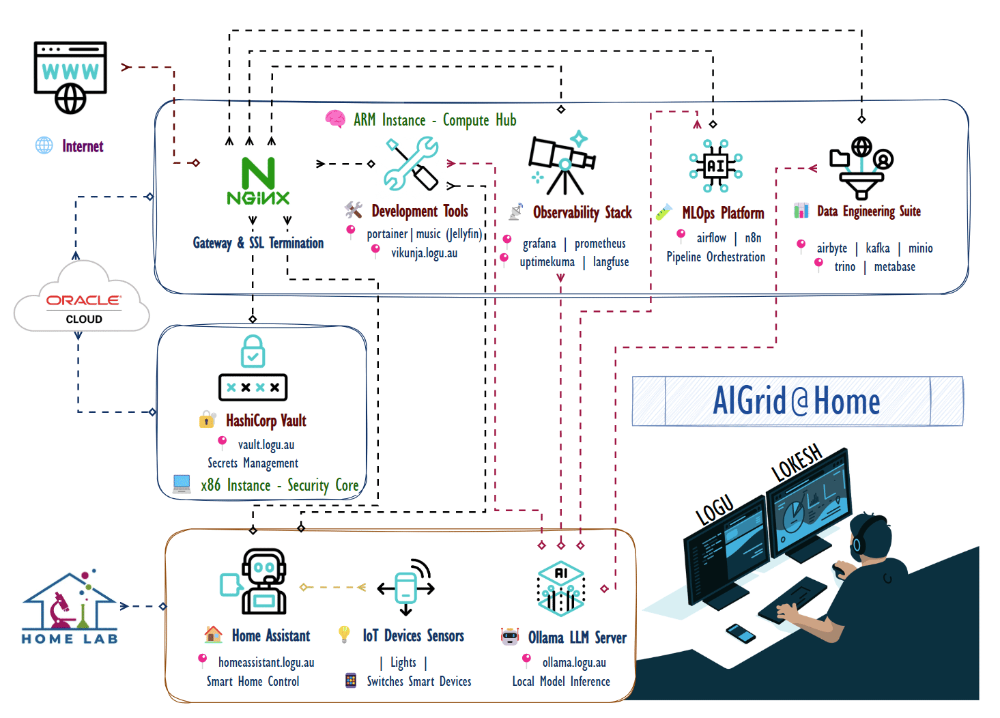

<div align="center">
  
  <!-- Animated Header -->
  
  
  <!-- Primary Action Badges -->
  <p>
    <a href="https://lab.logu.au">
      
    </a>
    <a href="https://logu.au">
      
    </a>
  </p>
  
  <!-- Tech Stack Badges -->
  <p>
    
    
    
    
    
    
  </p>
  
</div>

---

## 💭 **PHILOSOPHY & INSPIRATION**

<div align="center">
  
  <!-- Philosophy Section with Visual Elements -->
  <table>
    <tr>
      <td width="180" align="center">
        
      </td>
      <td align="center" style="padding: 0 30px;">
        <h2>🏛️ Ancient Wisdom ⚡ Modern Innovation 🚀</h2>
        <blockquote>
          <h3>கருவியும் காலமும் செய்கையும் செய்யும் <br>
          அருவினையும் மாண்டது அமைச்சு.</h3>
          <p><i>"Excellence emerges when one masters the tools, timing,<br>
          methodology, and the wisdom to tackle the impossible."</i></p>
          <p><strong>— Thirukkural 631 | Chapter: Ministers (அமைச்சு)</strong></p>
        </blockquote>
      </td>
      <td width="180" align="center">
        
      </td>
    </tr>
  </table>
  
</div>

> 💡 **This 2000-year-old wisdom drives my approach to solving 21st-century AI challenges—combining cutting-edge tools, perfect timing, methodical execution, and the audacity to make the impossible possible.**

---

## 🎯 **WHAT I DO**

<div align="center">

### 🚀 **The AI-Powered Banking Revolution**

<table>
<tr>
<td align="center" width="200">
  <br/>
  <strong>Banking regulations<br/>are complex</strong>
</td>
<td align="center" width="80">
  
</td>
<td align="center" width="200">
  <br/>
  <strong>AI needs to be<br/>compliant</strong>
</td>
<td align="center" width="80">
  
</td>
<td align="center" width="200">
  <br/>
  <strong>I make both<br/>work together</strong>
</td>
</tr>
</table>

<br/>

**Stack:** `GenAI` + `FinTech` + `Enterprise Architecture`  
**Status:** `Shipping intelligent compliance solutions`  

**Mission:** *Transforming complex financial data challenges into intelligent, scalable AI solutions* 🎯

<br/>

<table>
<tr>
<td width="30%" align="left" valign="top">

### 🎯 **Core Expertise**
- 🏦 **Banking & Finance**
- 🤖 **AI/ML Engineering**  
- ☁️ **Cloud Architecture**
- 🔐 **Compliance & Security**
- 📊 **Data Engineering**
- ⚡ **Real-time Systems**
- 🛡️ **AML & Fraud Detection**

### 📈 **Impact Metrics**
  
  
  


</td>
<td width="40%" align="center" valign="middle">


<br/>

**🔄 My Engineering Process:**  
`Identify Challenge` → `Design Solution` → `Build & Deploy` → `Scale Impact`

</td>
<td width="30%" align="left" valign="top">

### 🛠️ **Tech Stack Focus**
- 🐍 **Python & FastAPI**
- 🦙 **Ollama & Local LLMs**
- ☁️ **GCP & Oracle Cloud**
- 🐳 **Docker & Kubernetes**
- 📊 **Kafka & Spark**
- 🔍 **Vector Databases**
- 🌊 **Apache Airflow**

### 🎯 **Current Focus**
  
  
  


</td>
</tr>
</table>

<br/>

</div>

---

## 🏗️ **MY AI LABORATORY: SELF-HOSTED INFRASTRUCTURE**

<div align="center">
  
  ### 🔬 *Personal Oracle Cloud Infrastructure Laboratory*
  **Production-grade AI/ML experimentation platform for continuous innovation**
  
  
  
  
  
</div>

### 🏛️ **SYSTEM ARCHITECTURE**

<div align="center">
  
</div>

---

## 🌐 **COMPLETE SERVICE ECOSYSTEM**

### 🤖 **AI & MACHINE LEARNING CORE**

<div align="center">

| 🔧 **Service** | 🌐 **Domain** | 🎯 **Purpose** | 📊 **Status** |
|:--------------|:-------------|:-------------|:-------------|
| **🦙 Ollama** | `ollama.logu.au` | Local LLM Hosting & Inference |  |
| **⚡ Apache Spark** | `spark.logu.au` | Distributed ML Processing |  |
| **🌊 Apache Airflow** | `airflow.logu.au` | ML Pipeline Orchestration |  |
| **📈 Langfuse** | `langfuse.logu.au` | LLM Observability & Tracing |  |

</div>

### 📊 **DATA ENGINEERING PLATFORM**

<div align="center">

| 🔧 **Service** | 🌐 **Domain** | 🎯 **Purpose** | 📊 **Status** |
|:--------------|:-------------|:-------------|:-------------|
| **🔄 Airbyte** | `airbyte.logu.au` | Data Integration & ETL |  |
| **🚀 Apache Kafka** | `kafka.logu.au` | Real-time Data Streaming |  |
| **💾 MinIO** | `minio.logu.au` | Object Storage & Data Lake |  |
| **🔠Trino** | `trino.logu.au` | Distributed Query Engine |  |
| **📊 Metabase** | `metabase.logu.au` | Business Intelligence & Analytics |  |

</div>

### 🛠️ **INFRASTRUCTURE & OPERATIONS**

<div align="center">

| 🔧 **Service** | 🌐 **Domain** | 🎯 **Purpose** | 📊 **Status** |
|:--------------|:-------------|:-------------|:-------------|
| **🔒 Nginx Proxy Manager** | `nginx.logu.au` | Reverse Proxy & SSL |  |
| **🦠HashiCorp Vault** | `vault.logu.au` | Secrets Management |  |
| **🳠Portainer** | `portainer.logu.au` | Container Orchestration |  |
| **📈 Grafana** | `grafana.logu.au` | Metrics Visualization |  |
| **⚡ Prometheus** | `prometheus.logu.au` | Metrics Collection |  |
| **💚 Uptime Kuma** | `uptimekuma.logu.au` | Service Health Monitoring |  |
| **📠Traccar** | `traccar.logu.au` | GPS Tracking & Fleet Management |  |

</div>

### 🎨 **AUTOMATION & MEDIA**

<div align="center">

| 🔧 **Service** | 🌐 **Domain** | 🎯 **Purpose** | 📊 **Status** |
|:--------------|:-------------|:-------------|:-------------|
| **🔗 n8n** | `n8n.logu.au` | Workflow Automation |  |
| **🵠Jellyfin** | `music.logu.au` | Media Server & Streaming |  |

</div>

---

## 🏆 **FEATURED PROJECTS: KinAI ECOSYSTEM**

<div align="center">

### 🤖 *Privacy-First AI Applications Suite*
**Demonstrating end-to-end ML engineering expertise with real-world impact**


</div>

### 🏠 **SMART HOME & AUTOMATION**

#### 🔍 **[KinAI-Vision](https://github.com/Logulokesh/KinAI-Vision)** - *Real-time Activity Detection*
```
🎯 Culturally-aware home automation with YOLOv8 & InsightFace
🏗️ Scalable microservices architecture for privacy-first experiences  
🌍 Cultural context awareness for personalized automation
```

#### 📍 **[KinAI-GeoPulse](https://github.com/Logulokesh/KinAI-GeoPulse)** - *Privacy-First Family Tracking*
```
🔒 Local processing via Traccar Server & FastAPI
📊 Daily movement summaries with intelligent distance calculations
🌐 Real-time geofencing with privacy controls
```

### 🏥 **HEALTHCARE & FINANCIAL MANAGEMENT**

#### 💊 **[KinAI-CareVault](https://github.com/Logulokesh/KinAI-CareVault)** - *Secure Health Platform*
```
🧠 Powered by Gemma 3/MedGemma 3 for medical intelligence
📄 Intelligent document processing & family health tracking
🔐 Local workflows ensuring compliance & data sovereignty
```

### 🔐 **SECURITY & SURVEILLANCE**

#### 👁️ **[KinAI-NexPatrol](https://github.com/Logulokesh/KinAI-NexPatrol)** - *AI-Powered Surveillance*
```
🎯 AML-inspired risk scoring with YOLOv8 & InsightFace
🔒 Local processing for enhanced security & privacy
⚡ Precise threat detection algorithms for secure environments
```

### 🎓 **EDUCATION & LEARNING**

#### 📚 **[KinAI-ScholarKit](https://github.com/Logulokesh/KinAI-ScholarKit)** - *Offline Educational AI*
```
🧠 RAG pipeline with FAISS & NetworkX for personalized learning
🔒 Privacy-focused design with comprehensive PDF exports
📖 Curriculum-aligned educational content generation
```

#### 🗣️ **[KinAI-Mentor](https://github.com/Logulokesh/kinai-mentor)** - *Voice-Driven AI Tutor*
```
🎙️ Multi-modal interaction with Victorian Curriculum alignment
🔒 Complete privacy with local processing
♿ Inclusive design for diverse learning needs
```

---

## 📜 **Professional Certifications**

<div align="center">

### 🎓 **Google Cloud Platform Excellence**


### 🔶 **Oracle Cloud Infrastructure**


</div>

---

## 🧠 **CURRENT LEARNING FOCUS**

<div align="center">

<table>
<tr>
<td align="center" width="33%">

### 🔬 **GenAI & Financial Crime Detection**

```
🤖 Intelligent investigation assistants with LLMs
📚 RAG implementation for compliance documentation  
🎯 Advanced prompt engineering for financial analysis
```

</td>
<td align="center" width="33%">

### 🔄 **MLOps & Model Governance**

```
🦙 Self-hosted LLM deployment with Ollama & Llama.cpp
📊 ML model observability & concept drift detection
🏗️ Data mesh architecture with robust metadata management
```

</td>
<td align="center" width="33%">

### ⚡ **Advanced AI Infrastructure**

```
🔍 Vector database optimization for transaction similarity
⚡ Real-time model serving with low-latency requirements
🔄 Automated model retraining with continuous validation
```

</td>
</tr>
</table>

</div>

---

## 🛠️ **TECHNICAL ARSENAL**

<div align="center">

### ☁️ **CLOUD & INFRASTRUCTURE**


### 💻 **PROGRAMMING & DEVELOPMENT**


### 📊 **DATA & ANALYTICS**


### 🤖 **AI/ML & GenAI**


### 📈 **MONITORING & VISUALIZATION**


</div>

---

## 🤝 **LET'S COLLABORATE & INNOVATE**

<div align="center">

<table>
<tr>
<td align="center" width="33%">

### 🔍 **FINANCIAL CRIME TECHNOLOGY**

```
💰 Anti-Money Laundering (AML) system optimization
🕵️ Fraud detection algorithm development  
📋 Regulatory compliance automation
```

</td>
<td align="center" width="33%">

### 🏗️ **MODERN DATA ARCHITECTURE**

```
🌐 Data mesh implementation strategies
🏠 Lakehouse architecture design
⚡ Real-time analytics platforms
```

</td>
<td align="center" width="33%">

### 🤖 **AI/ML IN BANKING**

```
🧠 GenAI applications for financial services
⚖️ ML model governance & risk management
🛡️ Responsible AI implementation frameworks
```

</td>
</tr>
</table>

</div>

---

## 📬 **Let's Connect**

<div align="center">

### 🌟 Ready to discuss AI, cloud architecture, or innovative side projects? 

<a href="mailto:hello@logu.au">
  
</a>
<a href="https://linkedin.com/in/logulokesh">
  
</a>
<a href="https://github.com/logulokesh">
  
</a>

</div>

---

<!-- GitHub Activity Visualization -->
<div align="center">
  <h2>🐍 Commit 📝 → Push ⏫ → Repeat 🔁</h2>
  
  <picture>
    <source media="(prefers-color-scheme: dark)" srcset="https://github.com/Logulokesh/Logulokesh/blob/output/github-contribution-grid-snake-dark.svg">
    <source media="(prefers-color-scheme: light)" srcset="https://github.com/Logulokesh/Logulokesh/blob/output/github-contribution-grid-snake.svg">
    
  </picture>
  
  <br><br>
  
  <!-- GitHub Stats -->
  
  
  
  <br><br>
  
  <!-- GitHub Streak -->
  
  
</div>

---

<div align="center">
  
  ### 🌟 **"Excellence emerges when one masters the tools, timing, methodology, and the wisdom to tackle the impossible."**
  
  <sub>🚀 **Building the future of AI, one algorithm at a time** 🚀</sub>
  
</div>
